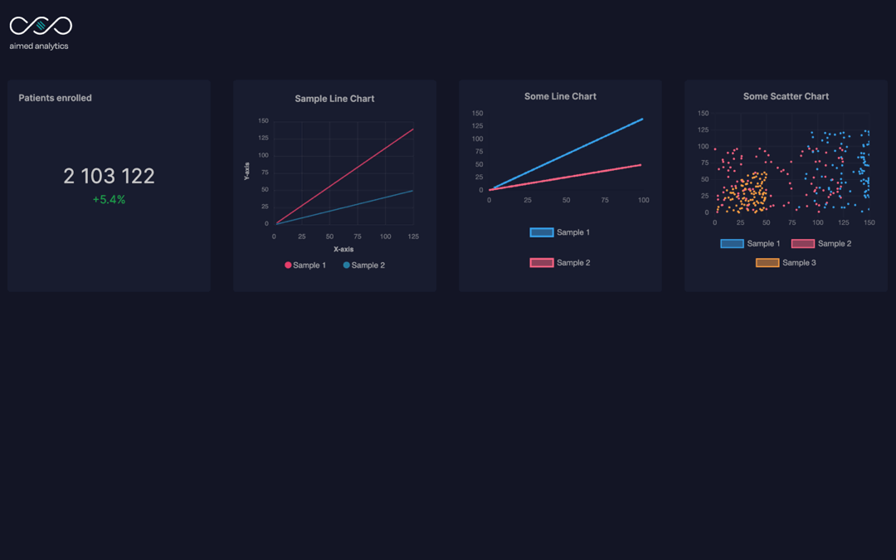

# BI Dashboard
Dashboard with several charts to visualise data from a BI system.\
Used both _Chart.js_ and _ApexCharts_ to display the data.\
Stack: **Next.js**, **React.js**, **TypeScript**, **Tailwind CSS**, **Docker**




## Run
#### Locally:
```bash
npm run dev
```

#### In a Docker container:
```bash
docker build -t nextjs-docker .
docker run -p 3000:3000 nextjs-docker
```

Open [http://localhost:3000](http://localhost:3000) with your browser to see the result.
